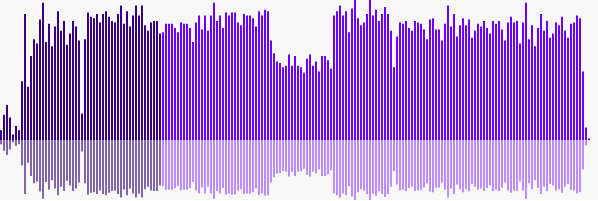

# waveform-visualizer

Visualizes waveform data (peaks), for example the ones that got generated using: <https://github.com/chrisweb/waveform-data-generator>

Waveform created using the visualizer with data using the "chrisweb waveform data generator"

## examples

Check out the [examples directory](/examples/README.md)

## getting started

### installing

* First, start by installing nodejs (<http://nodejs.org/>) (which includes npm)
* You will also have to install git (<http://git-scm.com/download>)
* Use git to clone this project locally
* Use your command line tool and go to the root of this project (type: cd /LOCAL_PROJECT_PATH)
* install the gulp cli globally npm install gulp-cli -g

## license

This project is licensed under the MIT License - see the [LICENSE.md](LICENSE.md) file for details
