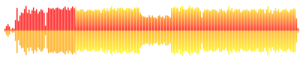

# waveform-visualizer

Visualizes waveform data (peaks), for example the ones that got generated using: <https://github.com/chrisweb/waveform-data-generator>

Waveform created using data that got generated using the [waveform data generator](https://github.com/chrisweb/waveform-data-generator)

## installation

if you want to use the waveform visualizer in your own project you can install it from npm using the following command:

`npm i waveform-visualizer`

## examples

Check out the [simple waveform example](/examples/simple-waveform/README.md)

## development: build

install the latest nodejs (if you haven't already) [nodejs](https://nodejs.org)  

install or update to the latest git version [git scm downloads](https://git-scm.com/downloads) (During installation at the step "choosing the default editor used by Git", if like me you are using visual studio code you might want to chose the new option "use visual studio code as Git's default editor") (also if like me you are on windows, at the step "adjusting your PATH environment", ensure the second radio button option is selected "git from the line and also from 3rd-party software" to ensure git is added to the windows PATH, which will allow you to use git with any command line tool like windows powershell for example)  

git clone this repository to get a local copy  

`git clone git@github.com:chrisweb/waveform-visualizer.git`

open your favorite command line tool and go to the root directory of this repository  

update npm to latest version  

`npm install npm@latest -g`

install the dependencies  

`npm i`

to build the distributions, use the following command:  

`npm run build`

in development you can use watch to have the build getting rebuild every time you edit code / save one of the typescript files  

## development: watch

`npm run watch`

## development: linting

to lint the typescript files  

`npm run lint`

## changelog

3.0.0 updated dependencies and removed UMD support, this and future versions will be ESM only

## contributing (help / PRs appreciated 😊)

you should first open a ticket and explain what fix or improvement you want to provide on the [github issues page](https://github.com/chrisweb/waveform-visualizer/issues) of this project (remember the github ticket number you will need it for the commit message later on)

go the [github page of this project](https://github.com/chrisweb/waveform-visualizer) and hit the fork button  

follow the instructions in the previous section ["development: build"](#development-build), but instead of cloning this projects repository, clone your own fork of the project  

`git clone git@github.com:YOUR_USERNAME/waveform-visualizer.git`

when you are done coding, commit your local changes (if your commit is related to a ticket start your commit message with the "#TICKER_NUMBER", this will "link" the commit to the ticket)  

`git commit -m "#TICKER_NUMBER commit message"`

now open your forks github URL in your browser and hit the pull request button

## note to self: publish package on npmjs.com

login to npmjs.com  

`npm login`

!!! before using the next the command ensure the version of your package in the package.json has been updated  

publish a new version on npmjs  

`npm publish`

## license

This project is licensed under the MIT License - see the [LICENSE](LICENSE) file for details
