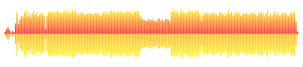
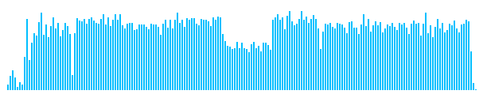

[](https://www.npmjs.com/package/waveform-visualizer)
[](https://www.npmjs.com/package/waveform-visualizer)
[](https://github.com/chrisweb/waveform-visualizer/blob/master/LICENSE)

# waveform-visualizer

Visualizes waveform data (peaks), for example the ones that got generated using: <https://github.com/chrisweb/waveform-data-generator>



Waveform created using data that got generated using the [waveform data generator](https://github.com/chrisweb/waveform-data-generator)

## installation

if you want to use the waveform visualizer in your own project you can install it from npm using the following command:

`npm i waveform-visualizer`

## examples

Check out the [simple waveform example](/examples/simple-waveform/README.md)

## documentation

### vanilla javascript example

Open your project in your favorite IDE (VSCode) and then [install](#installation) the waveform dependency

Now that the dependency is installed, import the waveform-visualizer package into your javascript code like this:

```js
import { Waveform } from 'waveform-visualizer'
```

if you are using typescript, which is what I will do now for the rest of this example, also import the interfaces so that we have typed options objects (for the core and the layout options), like so:

```ts
import { Waveform, IWaveLayoutOptions, IWaveCoreOptions, IWaveClickCallback } from 'waveform-visualizer'
```

next create a layout options object, to tweak the look of the waveform a bit:

```ts
const waveLayoutOptions: IWaveLayoutOptions = {
    waveTopPercentage: 50,
    peakTopFillStyle: 'deepskyblue',
    peakBottomFillStyle: 'dodgerblue ',
}
```

Note: a **fill style** can be a css color name (which is what we use here) or a color hex code or an rgb(a) color, a canvas gradient or a canvas pattern, for more details about what values can be used for the *FillStyle options, check out the [layout options chapter](#layout-options)

All layout options are optional, at this point we are only setting 3 options:

* the first one is called "waveTopPercentage" and is used to the tell the waveform where the middle is, if you set it to 50 like in this example, then the top of the waveform will be 50% and the bottom 50% too, meaning the top peaks will be a mirror image of the bottom peaks
* next we set **peakTopFillStyle** to deepskyblue, because we just set the waveTopPercentage to 50% the top half of the waveform peaks will use the **deepskyblue**
* finally we **peakBottomFillStyle** to **dodgerblue** meaning the bottom half peaks will be another color (of course if you prefer you can also use the same color twice for the bottom as well as the top peaks)

using these 3 options this is the result you will get:


if you prefer a wave which only displays the top peaks then set the value for **waveTopPercentage** to 100, the result look like this:



if you want to only display bottom peaks set **waveTopPercentage** to 0:


and if you want the top peaks to be bigger (70% of the height) than the bottom peaks (30% of the height), then set the value for **waveTopPercentage** to 70:


Note: You can also change the width of the peaks, the width of the space between peaks and a lot more via the layout options, for a full list of available options and their default values, check out the [layout options chapter](#layout-options) in this readme

Note 2: If you want to see an example of how to use gradient fill styles, check out the client code of the [simple waveform example](/examples/simple-waveform/README.md) in this repository

next we will create a **click callback** function, this callback will get triggered by the waveform every time a user clicks on the waveform, it will accept a parameter called **clickHorizontalPositionInPercent** which is the horizontal position (in percent) of the waveform based on the mouse position, this means that if the user clicks exactly in the middle of the waveform then this value will be 50%, based on that information you can then tell your audio (sound) player to seek (move) to that position of the song:

```ts
const waveformClickCallback = (clickHorizontalPositionInPercent: number): void => {

    console.log('waveformClickCallback: ', clickHorizontalPositionInPercent)

    // tell the audio player to move to 50% of the sound

}
```

Next create a core options object and we will add 4 options:

* the out layout options object
* the data for the waveform peaks
* our click callback function
* the ID of the canvas element

```ts
const waveCoreOptions: IWaveCoreOptions = {
    layout: waveLayoutOptions,
    data: [10,16,14,15,17,15,17,18,24,23,21,40,64,66,66,63,68,70,68,70,71,69,68,66,66,67,71,30,29,29,30,67,59,59,69,67,60,64,66,69,64,64,70,66,58,61,36,31,31,31,37,35,31,31,35,36,38,34,36,33,31,50,71,68,55,69,69,62,60,78,59,92,100,98,78,65,63,72,71,68,66,65,65,61,63,62,65,65,66,69,64,70,46,28,29,23,62,64,57,64,70,71,56,61,67,69,62,70,66,58,61,47,33,35,33,33,34,32,32,66,69,57,55,85,78,59,66,65,58,81,86,81,78,61,68,73,57,55,74,84,70,53,75,62,68,72,72,80,66,66,37,30,24,23,67,62,58,66,67,60,58,64,67,65,64,70,66,57,63,68,70,58,61,68,64,59,64,62,73,63,71,71,61,57,47,20,21,20,21,22,22,21,22,25,25,29,25,24,19,21],
    waveformClickCallback: onWaveClickHandler,
}
```

Note: if you want to generate peaks data for one of your songs or sounds, you can for example use another tool I created which is called **waveform-data-generator**, it is written in javascript (nodejs) and available on github too: <https://github.com/chrisweb/waveform-data-generator>

Now it is time to create an instance of the waveform visualizer and pass the core options object to it:

```ts
const waveform = new Waveform(waveCoreOptions)
```

Now we need to create an HTML canvas element to display the waveform, open your HTML document and create a new HTML canvas element like so:

```html
<canvas id="waveformCanvas"></canvas>
```

then back into our javascript code, get the canvas element and then pass it to the waveform using the **setCanvasElement** method:

```ts
const canvasElement = document.getElementById(visualizerOptions.canvasElementId) as HTMLCanvasElement

waveform.setCanvasElement(canvasRef.current)
```

Note: all the options can be set when creating the waveform instance or like above using setters, there are also getters for each option in case you want to read an option and know what value is currently set, for a full list of all setters and getters check out the [waveform methods chapter](#waveform-methods)

If you are not using vanilla javascript but React, then I recommend to use React Hook called [useRef](https://react.dev/reference/react/useRef) instead:

```ts
const canvasRef = useRef<HTMLCanvasElement>()

waveform.setCanvasElement(canvasRef.current)
```

Note: for a full react example check out the next chapter [](#react-component-example)

Final step, we need to tell the waveform to perform the initial draw so that something gets painted inside of our canvas element, like so:

```ts
waveform.draw()
```

The draw function has an optional parameter called **range**, the range must be a number between 0 and 100, it tells the waveform at what position your sound (song) currently it, if you have a player and that player allows you to set a callback function when the sound (song) is playing, then you should call the draw function again every time that playing progress callback gets triggered, like so:

```ts
const playerPlayingProgressCallback = (progressInPercent) => {
    waveform.draw(progressInPercent)
}
```

To see an example of what it looks like when the range gets modified, check out the animated gif on top of this README or install the example from this repository, which uses an audio player that redraws the waveform element every time its progress callback gets triggered: [simple waveform and audio player example](/examples/simple-waveform/README.md)

### React component example

Note: This code does the exact same thing as the previous example but uses React instead of vanilla javascript

React component example to create a waveform:

```ts
import { useRef, useCallback, useEffect } from 'react'
import { Waveform, IWaveLayoutOptions, IWaveCoreOptions } from 'waveform-visualizer'

const WaveformComponent = () => {

    const canvasRef = useRef<HTMLCanvasElement>()

    const onWaveClickHandler = useCallback((clickHorizontalPositionInPercent: number): void => {

        console.log('waveformClickCallback: ', clickHorizontalPositionInPercent)

        // tell the audio player to move to 50% of the sound

    }, [])

    const initializeWaveform = useCallback(() => {

        const waveLayoutOptions: IWaveLayoutOptions = {
            waveTopPercentage: 50,
            peakTopFillStyle: 'deepskyblue',
            peakBottomFillStyle: 'dodgerblue ',
        }

        const waveCoreOptions: IWaveCoreOptions = {
            layout: waveLayoutOptions,
            data: [10,16,14,15,17,15,17,18,24,23,21,40,64,66,66,63,68,70,68,70,71,69,68,66,66,67,71,30,29,29,30,67,59,59,69,67,60,64,66,69,64,64,70,66,58,61,36,31,31,31,37,35,31,31,35,36,38,34,36,33,31,50,71,68,55,69,69,62,60,78,59,92,100,98,78,65,63,72,71,68,66,65,65,61,63,62,65,65,66,69,64,70,46,28,29,23,62,64,57,64,70,71,56,61,67,69,62,70,66,58,61,47,33,35,33,33,34,32,32,66,69,57,55,85,78,59,66,65,58,81,86,81,78,61,68,73,57,55,74,84,70,53,75,62,68,72,72,80,66,66,37,30,24,23,67,62,58,66,67,60,58,64,67,65,64,70,66,57,63,68,70,58,61,68,64,59,64,62,73,63,71,71,61,57,47,20,21,20,21,22,22,21,22,25,25,29,25,24,19,21],
            waveformClickCallback: onWaveClickHandler,
        }

        const waveform = new Waveform(waveCoreOptions)

        waveform.setCanvasElement(canvasRef.current)

        waveform.draw(0)

    }, [onWaveClickHandler])

    useEffect(() => {
        initializeWaveform()
    }, [initializeWaveform])

    return (
        <div className="audioWaveForm">
            <canvas ref={canvasRef} width="200px" height="60px" />
        </div>
    )
})

export default WaveformComponent
```

## core options

* canvasElement?: [HTMLCanvasElement] (optional, if not set here you must use the **setCanvasElement** method) the canvas element that will get used to draw the waveform
* data?: [number[]], (optional, if not set here you must use the **setWaveData** method) an array of numbers (list of peaks values)
* layout?: [IWaveLayoutOptions], (optional, if not set the waveform will use its own default values, can be set later using the **setWaveData** method) a layout options object (for a full list of layout options check out the next [layout options chapter](#layout-options))
* waveformClickCallback?: [IWaveClickCallback], (optional, if not set here you must use the **setWaveformClickCallback** method) a callback function that will get triggered when the user clicks on the waveform, the first parameter of the callback is a number, it tells you the horizontal position of the click, for example a value of 50 means the user clicked in the middle of the waveform, based on that number you can tell your player to seek to that position of the sound (song), to see a working example check out the client source code of [simple waveform example](/examples/simple-waveform/README.md)

## layout options

* waveHeightInPixel: [number] (default: 100) the height of the waveform inside of the canvas element
* waveBackgroundFillStyle: [string (hex, rgb(a) or css color name) | CanvasGradient | CanvasPattern] (default: 'transparent') the background color of the waveform
* peakWidthInPixel: [number] (default: 2) the width in pixel of a single peak
* spaceWidthInPixel: [number] (default: 1) the width in pixel of the space between each peak
* waveTopPercentage: [number] (default: 50) a percentage value that defines how big the top half is compared to the bottom half, a value of 50 means the top and bottom half are each 50% of the total height, a value of 70 would create a waveform where the top peaks are 70% high and the bottom 30% of the total height, a value of 100 would only draw the top peaks and a value of 0 would only draw the bottom peaks
* peakTopFillStyle: [string (hex, rgb(a) or css color name) | CanvasGradient | CanvasPattern] (default: '#f222ff') the color used for the top peaks outside of the range (initial peak color, beyond the range)
* peakBottomFillStyle: [string (hex, rgb(a) or css color name) | CanvasGradient | CanvasPattern] (default: '#ff2975') the color used for the bottom peaks outside of the range (initial peak color, beyond the range)
* peakTopProgressFillStyle: [string (hex, rgb(a) or css color name) | CanvasGradient | CanvasPattern] (default: '#ffd319') the color used for the top peaks that are inside of the range
* peakBottomProgressFillStyle: [string (hex, rgb(a) or css color name) | CanvasGradient | CanvasPattern] (default: '#ff901f') the color used for the bottom peaks that are inside of the range

Note: every *FillStyle option accepts as value any [CSS color](https://developer.mozilla.org/en-US/docs/Web/CSS/color_value) (so any color string like 'transparent' or 'blue', any hex color like '#000' (hex for black is the default value) or an rgb(a) color like 'rgb(255,255,255)' or 'rgba(0,0,0,0.8)'), a [canvas gradient](https://developer.mozilla.org/en-US/docs/Web/API/CanvasGradient), or a [canvas pattern](https://developer.mozilla.org/en-US/docs/Web/API/CanvasPattern), read more: [MDN: canvas fillStyle property](https://developer.mozilla.org/en-US/docs/Web/API/CanvasRenderingContext2D/fillStyle)

Note: there is no option for the width of a waveform, the width will be determined by the amount of peaks values are in your data array, the width you set for the peaks and the width for the space between each peak: 

`waveform width = (amount of peaks * peaks width) + ((amount of peaks -1) * peak space width)`

## waveform methods

* setCanvasElement(canvasElement: HTMLCanvasElement): void, to set the canvas element that will be used to draw the waveform
* getCanvasElement(): HTMLCanvasElement, to get the canvas element
* setWaveData(data: number[]): void, to set the data array containing the values (numbers) for each peak
* getWaveData(): number[], to get the data of the peaks
* setLayoutOptions(layout: IWaveLayoutOptions): void, to pass new layout options to the waveform and change all or some of the layout options after the initialization of the waveform
* getLayoutOptions(): IWaveLayoutOptions, to get the current layout options
* setWaveformClickCallback(waveformClickCallback: IWaveClickCallback): void, to add the click callback to the waveform (which will get triggered when the user clicks on the canvas of the waveform)
* getWaveformClickCallback(): IWaveClickCallback, to get the current click callback
* draw(range?: number): void, to tell the waveform to draw the peaks, if a range is set (must be a number between 0 and 100) the color of the peaks inside of the range percentage can get drawn using a different color to show the current playing progress of the sound (or song)

## development: build

install the latest nodejs (if you haven't already) [nodejs](https://nodejs.org)  

install or update to the latest git version [git scm downloads](https://git-scm.com/downloads) (During installation at the step "choosing the default editor used by Git", if like me you are using visual studio code you might want to chose the new option "use visual studio code as Git's default editor") (also if like me you are on windows, at the step "adjusting your PATH environment", ensure the second radio button option is selected "git from the line and also from 3rd-party software" to ensure git is added to the windows PATH, which will allow you to use git with any command line tool like windows powershell for example)  

git clone this repository to get a local copy  

`git clone git@github.com:chrisweb/waveform-visualizer.git`

open your favorite command line tool and go to the root directory of this repository  

update npm to latest version  

`npm install npm@latest -g`

install the dependencies  

`npm i`

to build the distributions, use the following command:  

`npm run build`

in development you can use watch to have the build getting rebuild every time you edit code / save one of the typescript files  

## development: watch

`npm run watch`

## development: linting

to lint the typescript files  

`npm run lint`

## changelog

See [github releases page](https://github.com/chrisweb/waveform-visualizer/releases)

## contributing (help / PRs appreciated 😊)

you should first open a ticket and explain what fix or improvement you want to provide on the [github issues page](https://github.com/chrisweb/waveform-visualizer/issues) of this project (remember the github ticket number you will need it for the commit message later on)

go the [github page of this project](https://github.com/chrisweb/waveform-visualizer) and hit the fork button  

follow the instructions in the previous section ["development: build"](#development-build), but instead of cloning this projects repository, clone your own fork of the project  

`git clone git@github.com:YOUR_USERNAME/waveform-visualizer.git`

when you are done coding, commit your local changes (if your commit is related to a ticket start your commit message with the "#TICKER_NUMBER", this will "link" the commit to the ticket)  

`git commit -m "#TICKER_NUMBER commit message"`

now open your forks github URL in your browser and hit the pull request button

## note to self: publish package on npmjs.com

login to npmjs.com  

`npm login`

!!! before using the next the command ensure the version of your package in the package.json has been updated  

publish a new version on npmjs  

`npm publish`

## license

This project is licensed under the MIT License - see the [LICENSE](LICENSE) file for details
